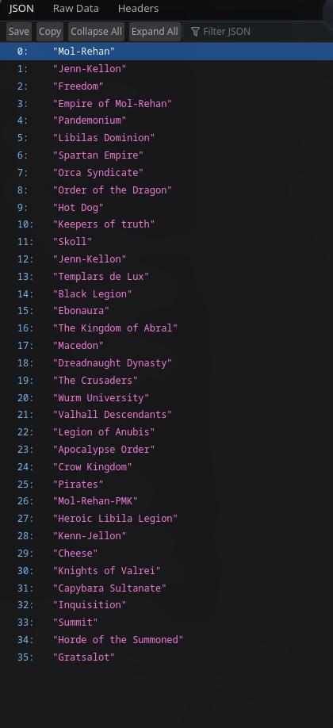
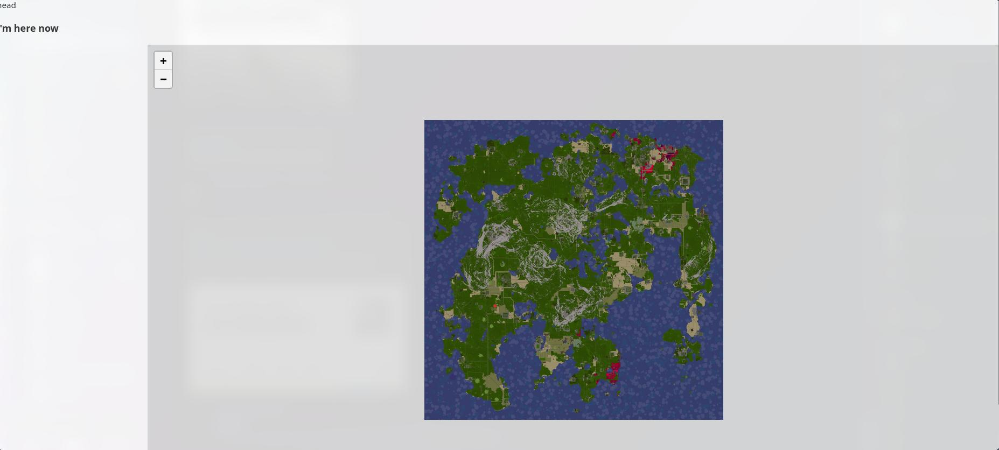

#WurmMaps Program

## How To Setup
- copy the 'copyme' application yml's without copy me, etc and enter your information
- initial kingdom setup:
  - [localhost:7077/api/getMap/testInput](localhost:7077/api/getMap/testInput)
- To get kingdom json:
  - [localhost:7077/api/kingdoms](localhost:7077/api/kingdoms)
  - 
- Access Map:
  - [localhost:7077/map](localhost:7077/map)
  - 
## Tech Stack
- PostGIS (Postgres) [docker] for map data (available)
  - if you create new database you need to run sql to enable extensions for each specific database used
- Keycloak (Oauth2) [docker] for auth (not available: locally)
  - See [keycloak in docker tutorial](https://www.keycloak.org/getting-started/getting-started-docker)
- Thymeleaf for html templating and more server side rendering-esk
- LeafletJS [webjar] for map Front end
- Java Spring Boot (Web, JPA, Security) for server side operations

## Other

- This is a major WIP, use at your own risk